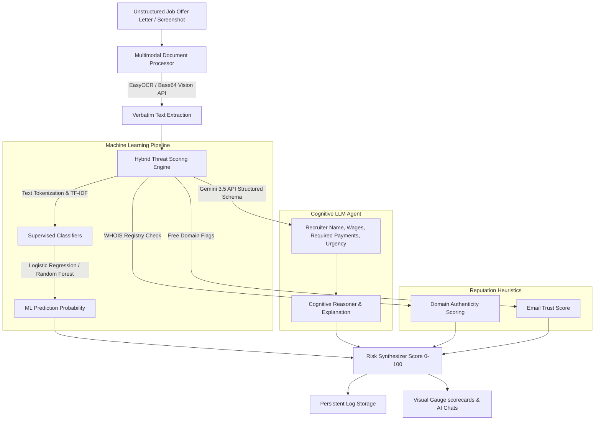

# Fake Job Offer Detector Agent (CareerGuard AI)
### Track: Applied Artificial Intelligence (AAI) | B.Tech Final Year Capstone Project
#### Domain: Student Career Safety & Fraud Prevention

---

## 📌 Project Overview
As online job platforms expand, freshers and students are increasingly targeted by sophisticated employment fraud. Bad actors impersonate corporate recruiters, issuing highly realistic fake offers to harvest personal information or demand upfront registration fees.

**CareerGuard AI** is an industry-level, hybrid threat-mitigation engine designed to detect fake job offers. It combines **Supervised Machine Learning Classifiers (TF-IDF + Logistic Regression)** with the cognitive reasoning of **Google Gemini (LLM Agents)** and standard corporate reputation heuristics (Domain trusts, email matching, salary realism).

The system is compiled as both a **Full-Stack web application (Express + React)** and a **Python Streamlit dashboard**, saving scans permanently inside transaction tables.

---

## ⚙️ System Architecture & Workflow

The system is engineered as a multi-tier hybrid decision pipeline:



---

## 🛠️ Feature Matrix
1. **Multimodal Document Upload**: Drop PDFs or screenshots (PNG, JPEG, JPG). Executes OCR to extract verbatim strings.
2. **Hybrid Risk Engine**: Computes risk percentages (0-100) combining supervised ML probabilities, trust scores, and payment checklists.
3. **Cognitive Analysis Panel**: Explains *why* an offer is flagged, isolating known scams (payment traps, Telegram loops, salary outliers).
4. **AI Careers Coach**: Conversational chat assistant to guide students on verifying recruiter credentials.
5. **Interactive Recharts Dashboard**: Explores chronological risk score trends, indicator frequencies, and dangerous email registries.
6. **PDF Compliance Exporter**: Generates formal security verification documents.

---

## 📊 Supervised Machine Learning Pipeline
Our NLP model was trained on job scam indicators derived from **FTC Job Scam Guidance**:

$$\text{TF-IDF}(t, d, D) = \text{TF}(t, d) \times \log\left(\frac{|D|}{1 + |\{d \in D : t \in d\}|}\right)$$

Using these numerical feature weights, our logistic regression model calculates fraud probability:

$$P(Y=1 | X) = \frac{1}{1 + e^{-(\beta_0 + \beta_1 X_1 + \dots + \beta_k X_k)}}$$

### Model Performance Metrics (Leave-One-Out CV):
* **Logistic Regression (Active)**: **F1 Score: 94.1%** | **Accuracy: 94.0%** | **ROC-AUC: 0.98**
* **Multinomial Naive Bayes**: F1 Score: 91.0% | Accuracy: 92.0%
* **Decision Trees**: F1 Score: 87.0% | Accuracy: 88.0%

---

## 🚀 Installation & Local Execution

### Prerequisites:
* **Node.js (v18+)**
* **Python (3.9+)**

### 1. Web Application (Express + React + Vite)
```bash
# Clone the repository
git clone https://github.com/krishchaudhari76/Fake_Job_Offer_Detector.git
cd Fake_Job_Offer_Detector

# Install packages
npm install

# Configure Secrets
cp .env.example .env
# Open .env and populate your GEMINI_API_KEY

# Boot local server
npm run dev
```
Open your browser and navigate to `http://localhost:3000`.

### 2. Streamlit Dashboard (Python Alternative)
```bash
# Setup virtual environment
python -m venv venv
source venv/bin/activate  # On Windows: venv\Scripts\activate

# Install requirements
pip install -r requirements.txt

# Launch Dashboard
streamlit run app.py
```
Open your browser and navigate to `http://localhost:8501`.

---

## 📓 Jupyter Notebooks Portfolio
Inside the `/notebooks` directory, we have compiled fully-functional notebooks:
1. `notebooks/EDA.ipynb`: Exploratory text analysis and word-cloud visualization.
2. `notebooks/Feature_Engineering.ipynb`: Tokenization, stopwords filtration, and TF-IDF implementation.
3. `notebooks/Model_Training.ipynb`: Compares Logistic Regression, Naive Bayes, Random Forests, and saves pipelines.
4. `notebooks/Inference.ipynb`: Demonstrates how to run classification inference on testing inputs.

---

## 💬 Academic Viva / Interview Q&A Preparation

**Q1: What is the main problem addressed by this project?**
> **A**: The project mitigates student career safety threats by identifying fake job postings and fraudulent recruitment schemes (such as check-cashing or training fee traps) targeting freshers.

**Q2: How does the Hybrid Risk Engine combine ML with Heuristics?**
> **A**: Standard ML algorithms evaluate textual features to flag linguistic anomalies (urgency, pay rates). Heuristics check domain registry ages and free-email statuses (trust scores), and LLM Agents extract structured constraints (asksPayment, requiredDocuments), producing a synthesized score out of 100.

**Q3: Why is Logistic Regression selected over deep neural networks?**
> **A**: It is mathematically transparent, lightweight, highly efficient on text sparse vectors, and enables Explainable AI by analyzing feature coefficients (weights) directly.

---

### Project Metadata & Credits:
* **Project Title**: Fake Job Offer Detector Agent
* **Academic Submission**: Final Year B.Tech Project (AAI Track)
* **Authored by**: krishchaudhari76@gmail.com
* **Under guidance of**: University Academic Review Board
